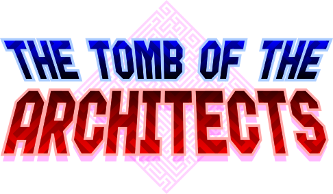
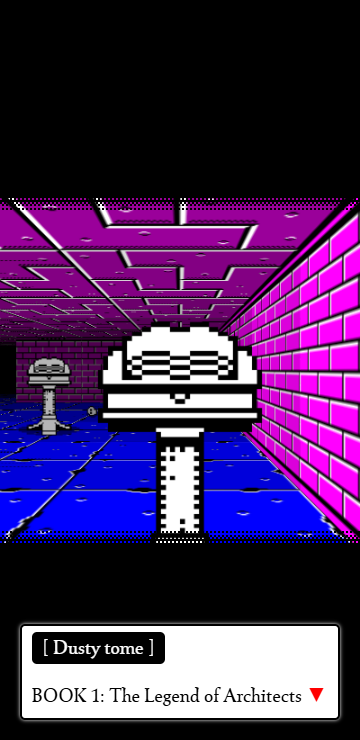
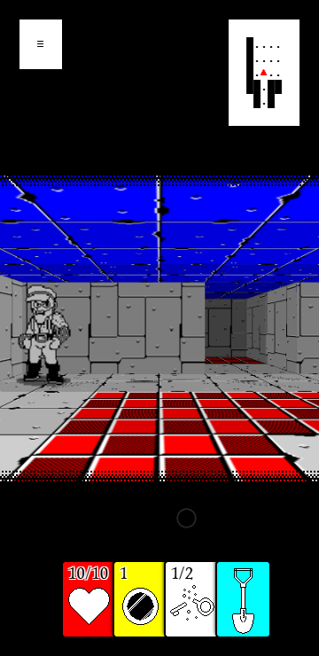
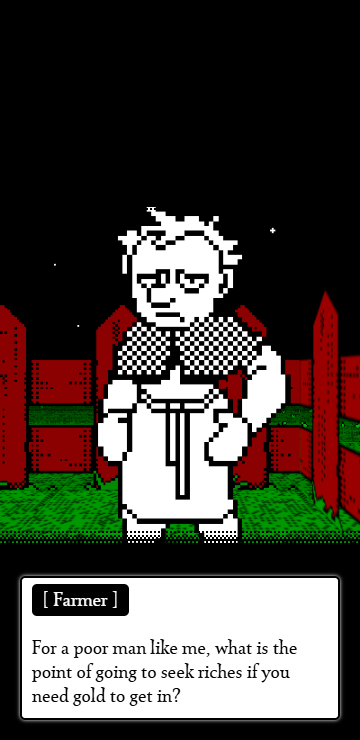

# The Tomb Of The Architects

A Roguelike <i>Ludocrawler</i> with a small daily deadly challenge for you.

---

<a href="https://www.kesiev.com/ttota/">Play</a> | <a href="https://discord.gg/TeAWvnuGku">Discord</a>

---

## The story

Long time ago, merchants and kings used to store their belongings in dungeons. The Architects' Guild housed the tortuous minds of these dungeon designers. One day, their members began to disappear one after another.

    

Today, we have no trace of them.

Legend has it that they gathered in a secret dungeon, to plan their own tomb...

## The project

**TTOTA** is a browser Roguelike _Ludocrawler_ game for desktop and mobile. Sorry for the made-up term but I needed it.

    

I'm used to leave a _long design rambling/postmortem_ document in these README files. I'm not sure if someone reads them or not. Anyway, if you were looking for them, you're out of luck this time. You've _to find them in the dungeons_. Have fun!

    

### Why?

One day, I've been searching for _anything_ to kill time. I only found _something_. So I made this myself.

I hope someone else will find it fun and/or useful!

### Tech stuff

#### Making your own Tombs

ATM there is no documentation but there are a lot of examples, sorry. Anyway, I've prepared a tiny tutorial. Have a look at the [index.html](index.html) commented lines to start your journey!

### Credits

It's a very long list, this time. Look for it in the game.
